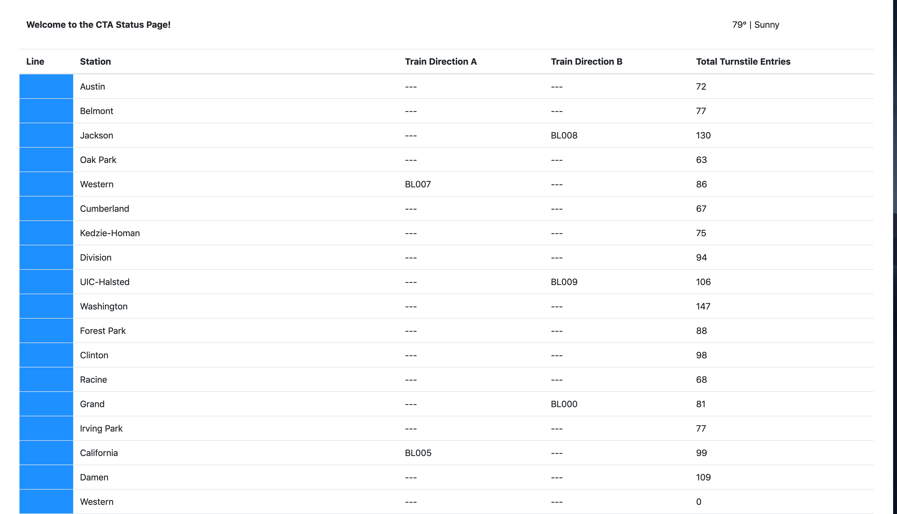

# Chicago Transit Authority Status dashboard

This is a project for Udacity Data Streaming Nanaodegree.  It processes Chicago Transit Authority data providing a dashboard displaying train arrivals in real or near-real time.
The goal is to consume the data using Apache Kafka, Faust and Python
The dataset is publicly available via the [Chicago Transit Authority](https://www.transitchicago.com/data/).

Here's a screenshot of the expected dashboard:




## Development Environment

The development requires the libraries and tool along with their dependencies:
	
- Python 3.7
- Apache Kafka
- Postgresql 11
- Faust
- Python libraries as specified in requirements.txt in the Producers and Consumers directories.
- Access to a computer with a minimum of 16gb+ RAM and a 4-core CPU to execute the simulation

Using the 

## Description

The Chicago Transit Authority (CTA) has asked us to develop a dashboard displaying system status for its commuters. We have decided to use Kafka and ecosystem tools like REST Proxy and Kafka Connect to accomplish this task.

Our architecture will look like so:


### Running the system 

```bash
python producers/simulation.py

cd consumers

faust -A faust_stream worker -l info

python consumers/ksql.py

python consumers/server.py
```

#### Tools/Libraries Documentation

* [Confluent Python Client Documentation](https://docs.confluent.io/current/clients/confluent-kafka-python/#)
* [Confluent Python Client Usage and Examples](https://github.com/confluentinc/confluent-kafka-python#usage)
* [REST Proxy API Reference](https://docs.confluent.io/current/kafka-rest/api.html#post--topics-(string-topic_name))
* [Kafka Connect JDBC Source Connector Configuration Options](https://docs.confluent.io/current/connect/kafka-connect-jdbc/source-connector/source_config_options.html)
