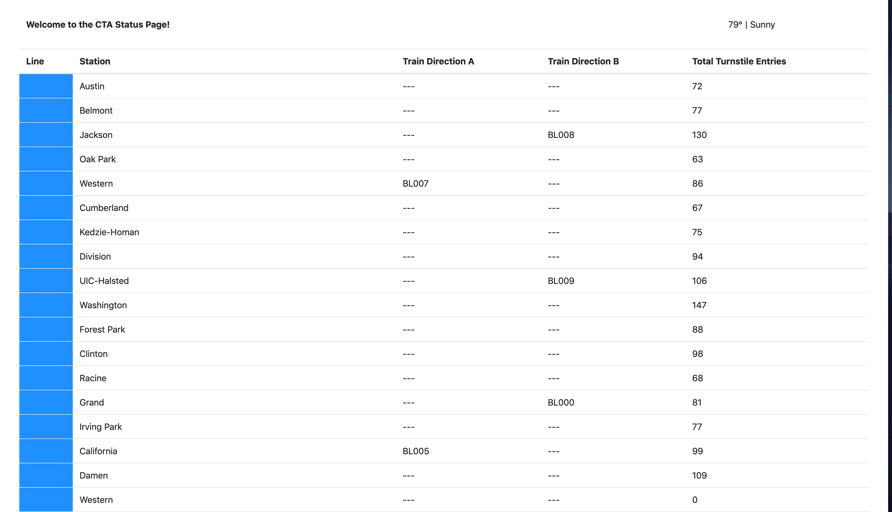
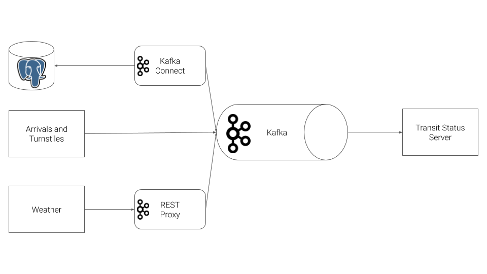

# City Transit Platform — Historical Streaming Project

> **Status:** Archived / historical engineering project. This repository is retained for provenance and learning value; it is not an actively maintained production platform.

This project was created as part of the **Udacity Data Streaming Nanodegree**. It processes Chicago Transit Authority (CTA) data and demonstrates a streaming architecture built around Apache Kafka, Faust, Python, PostgreSQL and Confluent ecosystem tooling.

The code reflects the technology and course environment at the time it was written, including Python 3.7, PostgreSQL 11 and older Kafka/Faust-era tooling. It should therefore be treated as a historical case study rather than a current implementation template.

## What it demonstrates

- Kafka producers and consumers
- event-stream processing with Faust
- ksqlDB / Confluent-style stream processing concepts
- PostgreSQL-backed transit data
- simulated CTA train-arrival data
- a near-real-time status dashboard architecture

The underlying CTA dataset is publicly available from the Chicago Transit Authority.



## Historical architecture



A representative development flow was:

```bash
python producers/simulation.py

cd consumers
faust -A faust_stream worker -l info
python consumers/ksql.py
python consumers/server.py
```

## Archive policy

No feature development is planned in this repository. If a streaming pattern remains useful, migrate the specific concept into an actively maintained repository such as `data-engineerings` rather than reviving this codebase wholesale.

The repository is intentionally retained as evidence of earlier hands-on work with Kafka, stream processing and data-engineering architecture.

## Original reference stack

- Python 3.7
- Apache Kafka
- PostgreSQL 11
- Faust
- Confluent REST Proxy / Kafka Connect / ksqlDB concepts

Security, dependency and operational assumptions should be re-evaluated before running this code on a modern environment.
